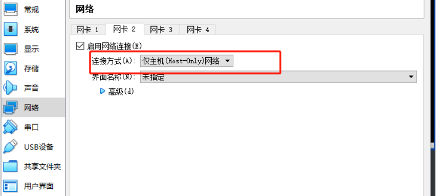
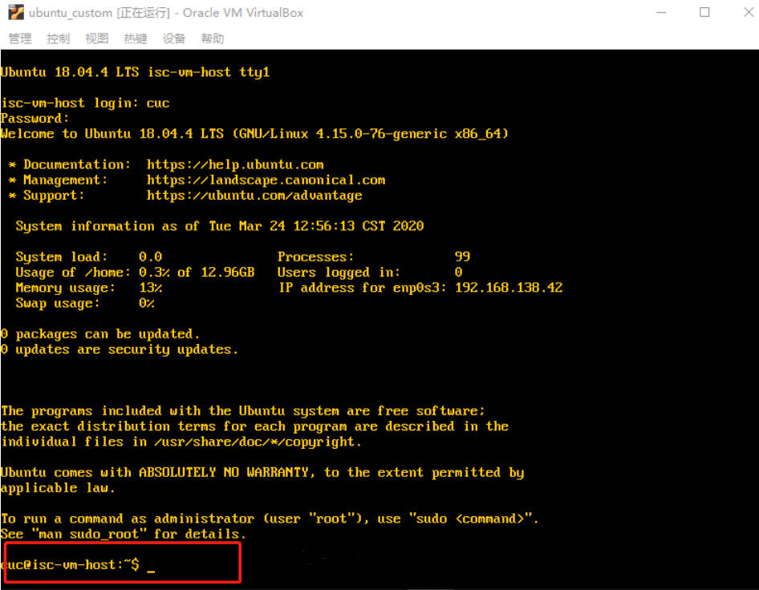

# 无人值守Linux安装镜像制作

## 实验环境

- ##### Ubuntu18.04服务器

  - 网卡：NAT，Host-Only
  - 原文：ubuntu-18.04.4-server-amd64.iso

- 基于preseed实现无人值守安装只能选择非live服务器版本，如ubuntu-18.04.4-server-amd64.iso

## 实验要求

- 完成无人值守iso充分制作
  - 定制一个普通用户名和预设密码
  - 定制安装OpenSSH服务器
  - 安装过程禁止自动联网更新间隔
- 在Virtualbox中完成自动化安装
  - 设置双网卡：NAT +仅限主机
  - Virtualbox安装完Ubuntu之后新添加的网卡如何实现系统开机自动启用和自动获取IP
  - ssh与远程服务器管理
    - ssh免密登录
    - ssh跳板登录
  - 使用sftp在虚拟机和宿主机之间的传输文件

## 实验过程

1、安装Ubuntu虚拟机（有人值守），为该系统设置双网卡，分别为NAT和主机。在当前用户目录下创建一个用于挂载iso副本文件的目录



`mkdir loopdir`

2、将`ubuntu-18.04.4-server-amd64.iso`远程复制到虚拟机中，**检验校正和**

3、挂载iso阳离子文件

```
mount -o loop ubuntu-18.04.4-server-amd64.iso loopdir/
sudo mount -o loop ubuntu-18,04,4-server-amd64.iso loopdir/
```

4、创建一个工作目录`cd`用于克隆光盘内容。同步光盘内容到目标工作目录。

```
mkdir cd
rsync -av loopdir/ cd
```

5、卸载iso最大值

6、进入`cd`目标工作目录。编辑Ubuntu安装引导界面，增加一个新菜单项入口。

```
cd cd/
# 
sudo vim isolinux/txt.cfg

# txt.cfg 中我们添加的自动安装菜单选项一定要「置顶」
# 不能通过修改文件首行 default 参数的取值来实现自动选中菜单开始安装系统的目的
# 添加以下内容到该文件后强制保存退出
label autoinstall
  menu label ^Auto Install Ubuntu Server
  kernel /install/vmlinuz
  append  file=/cdrom/preseed/ubuntu-server-autoinstall.seed debian-installer/locale=en_US console-setup/layoutcode=us keyboa
```

结果


7、定制一个普通用户名和替换密码。在官方示例中，取消注释和将用户名的`Ubuntu User`替换`cuc`，替换密码的`ubuntu`更改`1234`。

```
# To create a normal user account.
d-i passwd/user-fullname string cuc
d-i passwd/username string cuc

d-i passwd/user-password password 1234
d-i passwd/user-password-again password 1234

d-i user-setup/allow-password-weak boolean true
```

8、定制安装OpenSSH Server。取消官方示例中关于`openssh`的注释。

```
d-i tasksel/first multiselect none
d-i pkgsel/include string openssh-server python

# Individual additional packages to install
d-i pkgsel/include string openssh-server build-essential
```

9、更改时区

```
d-i time/zone string Asia/Shanghai
```

10、分区磁盘

```
d-i partman-auto/init_automatically_partition select biggest_free
```

### 安装virtualbox无人值守

```
scp -r cuc@192.168.56.3:/home/cuc/custom.iso ./
```

输入定制的用户名和密码即可


### 借助git bash尝试ssh免密登录

```
生成密钥对：ssh-keygen -t rsa
将公钥发送至服务器：ssh-copy-id kimo@192.168.51.107
免密登录：ssh kimo@192.168.51.107
```


### 「无人值守」镜像

将iso发送到虚拟机中


挂载镜像（来自参考文件），并同步光盘内容到工作目录

```
# 在当前用户目录下创建一个用于挂载iso镜像文件的目录
mkdir loopdir

# 挂载iso镜像文件到该目录
sudo mount -o loop ubuntu-18.04.4-server-amd64.iso loopdir
# 创建一个工作目录用于克隆光盘内容
mkdir cd
 
# 同步光盘内容到目标工作目录
# 一定要注意loopdir后的这个/，cd后面不能有/
rsync -av loopdir/ cd

# 卸载iso镜像
umount loopdir

# 进入目标工作目录
cd cd/

# 编辑Ubuntu安装引导界面增加一个新菜单项入口
vim isolinux/txt.cfg
```

卸载镜像

```
sudo umount loopdir
```

添加以下内容后强制保存退出

```
label autoinstall
  menu label ^Auto Install Ubuntu Server
  kernel /install/vmlinuz
  append  file=/cdrom/preseed/ubuntu-server-autoinstall.seed debian-installer/locale=en_US console-setup/layoutcode=us keyboa
```


修改isolinux/isolinux.cfg，增加内容`timeout 10`


生成iso(参考了同学的步骤)

```
# 重新生成md5sum.txt
cd ~/cd && find . -type f -print0 | xargs -0 md5sum > md5sum.txt

# 封闭改动后的目录到.iso
IMAGE=custom.iso
BUILD=~/cd/

mkisofs -r -V "Custom Ubuntu Install CD" \
            -cache-inodes \
            -J -l -b isolinux/isolinux.bin \
            -c isolinux/boot.cat -no-emul-boot \
            -boot-load-size 4 -boot-info-table \
            -o custom.iso .

# 如果目标磁盘之前有数据，则在安装过程中会在分区检测环节出现人机交互对话框需要人工选择
```

（install之前记得apt update）

安装所需的包以后成功生成iso


最后将生成的iso传到主机，获得定制好的镜像，接着新建虚拟机并安装ubuntu系统，实现无人值守！



## 参考资料

- [无人值守安装ISO制作过程示例](https://c4pr1c3.github.io/LinuxSysAdmin/chap0x01.exp.md.html#/iso)
- [apt-get更新无法获取文件，“临时故障正在解决...”错误](https://askubuntu.com/questions/91543/apt-get-update-fails-to-fetch-files-temporary-failure-resolving-error)
- [卸载正在使用的分区](https://superuser.com/questions/319661/what-does-the-following-disks-have-mounted-partitions-mean-while-installing-ub)
- [在无人照管的Ubuntu安装过程中删除卸载分区磁盘提示](https://askubuntu.com/questions/634805/removing-the-unmount-partition-disks-prompt-during-unnattended-ubuntu-install)
- 参考师姐和同学们的作业
- [linux课本](https://github.com/c4pr1c3/LinuxSysAdmin)
- [安装过程](https://www.bilibili.com/video/BV1E741127YM)


